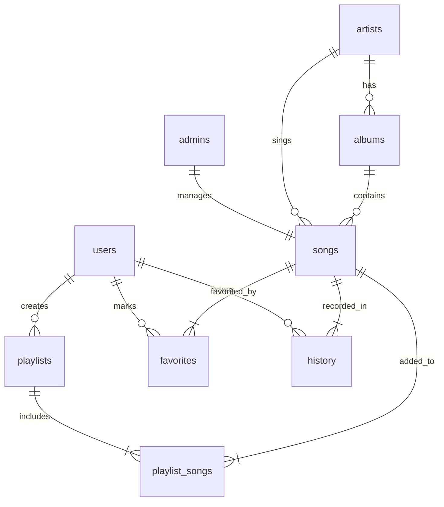

# Music Player Management System (MPMS)

A robust Command-Line Interface (CLI) application developed in **Java** and backed by a **MySQL** database. It simulates a music player environment with rich user/administrator modules, queue/stack-based song management, custom search/sort algorithms, multi-threaded playback simulation with progress bars, and activity logging.

---

## 🎧 Features

### 1. User & Admin Authentication
* **User Management**: Support for user registration (with security questions/answers for password recovery), login, and profile management.
* **Admin Portal**: Admin-specific operations such as adding new songs, artists, and albums directly to the system catalog.
* **Session Management**: Secure logout and session handling for both users and administrators.

### 2. Music Catalog & Playback
* **Interactive Player Simulation**: Song playback runs on a separate thread (`PlaybackThread`), displaying an interactive real-time visual progress bar.
* **Playback Controls**: While a song is playing, users can dynamically **Pause**, **Resume**, or **Stop** playback.
* **Song Search**: 
  * **Binary Search**: Fast searching by song title (requires a pre-sorted list).
  * **Linear Search**: Versatile filtering by **Title**, **Artist**, **Album**, **Genre**, or **Language**.
* **Song Sorting**:
  * **Bubble Sort**: Sorts the catalog by **Release Year** (ascending).
  * **Merge Sort**: Sorts the catalog by **Duration** (ascending).

### 3. Smart Queue & Playback History
* **Custom Play Queue (`PlayQueue`)**: Implemented using a custom **Circular Queue / Deque** array (capacity: 50). Supports:
  * Adding songs to the end (`enqueue`) or playing a song next (pushing to the front of the queue).
  * Navigation to the **Next** or **Previous** song.
  * Queue shuffling, clearing, and specific song removal.
* **Recently Played Stack (`RecentStack`)**: A custom array-based **Stack** (capacity: 10) tracking recently played tracks. Automatically shifts elements and eliminates duplicates.
* **Favorites List**: Users can add or remove songs to/from their personal favorites.

### 4. System Logs & Reporting
* **Dynamic Logging**: Writes general application logs to `system_activity.log`.
* **Dynamic User-Specific Logging**: Automatically creates a dedicated database table for each registered user (e.g. `` `username` ``) to log detailed actions (logins, playback, playlist changes).
* **Reports Module**:
  * Displays **Top 10 Most Played Songs** using a priority queue.
  * Tracks system-wide **Playlist Metrics** and **Most Active Users**.
  * Supports exporting a user's **Listening History** or individual **Playlists** to `.txt` files.

---

## 🗄️ Database Architecture

The system uses a relational database schema defined in [database/schema.sql](file:///d:/Music_player_Mangment_System/database/schema.sql).



### Key Tables
1. **`users`**: Stores client login credentials, profile data, and security questions.
2. **`admins`**: Stores system administrator credentials.
3. **`artists`**: Artists details (Unique Name).
4. **`albums`**: Album details linked to artists.
5. **`songs`**: Song catalog including title, genre, language, duration, release year, and play counts.
6. **`playlists`**: Metadata of user-created playlists.
7. **`playlist_songs`**: Junction table mapping songs to playlists.
8. **`favorites`**: Junction table storing users' favorited songs.
9. **`history`**: Audit trail of songs played by users.
10. **`[username]` (Dynamic)**: Dynamic user activity logs containing actions, timestamps, and log details.

---

## 📂 Project Structure

```
Music_player_Mangment_System/
│
├── database/
│   └── schema.sql                # MySQL database schema and sample data seeds
│
├── src/
│   ├── Main.java                 # Entry point of the application
│   ├── MenuController.java       # Controls all interactive CLI menus and flow logic
│   ├── DatabaseConnection.java   # Configures and opens MySQL JDBC connections
│   ├── DatabaseHelper.java       # Database operation helper (CRUD, queries, user logging)
│   ├── MusicPlayerService.java   # Playback service running on independent thread
│   │
│   ├── Song.java                 # Entity class representing a track
│   ├── User.java                 # Entity class representing a standard user
│   ├── Admin.java                # Entity class representing an administrator
│   ├── Playlist.java             # Entity class representing a custom user playlist
│   │
│   ├── PlayQueue.java            # Custom circular Queue/Deque implementation for playback
│   ├── RecentStack.java          # Custom Stack implementation for recently played songs
│   ├── SongSearch.java           # Search algorithms (Binary & Linear search)
│   ├── SongSort.java             # Sorting algorithms (Bubble & Merge sort)
│   │
│   ├── ReportGenerator.java      # Analyzes metrics and prepares system logs/statistics
│   ├── FileExporter.java         # Exports playlists and listening histories to text files
│   ├── LoggerUtility.java        # Main file logger for tracking general activity
│   │
│   ├── DatabaseConnectionException.java # Custom database exceptions
│   ├── DuplicateSongException.java      # Custom catalog duplicate exceptions
│   └── InvalidLoginException.java       # Custom authorization exceptions
│
├── Music_player_Mangment_System.iml     # IntelliJ project configuration
└── system_activity.log                  # Autogenerated system log file
```

---

## 🛠️ Setup & Installation

### Prerequisites
1. **Java Development Kit (JDK)**: JDK 8 or higher (JDK 17+ recommended).
2. **MySQL Server**: Ensure a local MySQL server is installed and running on port `3306`.
3. **MySQL JDBC Driver**: The project requires the MySQL Connector/J driver (`mysql-connector-j-9.3.0.jar` or similar).

### Database Initialization
1. Start your MySQL Server.
2. Open your MySQL client/terminal and run:
   ```sql
   SOURCE d:/Music_player_Mangment_System/database/schema.sql;
   ```
   *This will create the database `music_player_db` along with all tables, constraints, default administrator credentials (`admin`/`admin123`), and sample songs.*

### Application Configuration
Database connection credentials are set in [DatabaseConnection.java](file:///d:/Music_player_Mangment_System/src/DatabaseConnection.java):
* **URL**: `jdbc:mysql://localhost:3306/music_player_db`
* **Username**: `root`
* **Password**: `""` (Empty string)

*Modify these credentials in [DatabaseConnection.java](file:///d:/Music_player_Mangment_System/src/DatabaseConnection.java) if your MySQL setup differs.*

---

## 🚀 Compilation & Running

### Option 1: Using an IDE (Recommended)
1. Open the project directory `Music_player_Mangment_System` in IntelliJ IDEA or Eclipse.
2. Ensure the MySQL Connector/J JAR file is added to your project's library dependencies.
3. Locate `src/Main.java`, right-click, and select **Run 'Main'**.

### Option 2: Running via Command Line
1. Navigate to the project root directory.
2. Compile the source files, specifying the class path for the MySQL driver jar:
   ```cmd
   javac -cp "libs/mysql-connector-j-9.3.0.jar" -d bin src/*.java
   ```
3. Execute the application:
   ```cmd
   java -cp "bin;libs/mysql-connector-j-9.3.0.jar" Main
   ```
   *(Note: Replace `libs/mysql-connector-j-9.3.0.jar` with the actual path to your JDBC driver file. On Linux/macOS, use a colon `:` instead of a semicolon `;` as a classpath separator).*

---

## 📜 Default Credentials

* **System Admin**:
  * **Username**: `admin`
  * **Password**: `admin123`
* **Standard User (Sample)**:
  * **Username**: `john_doe`
  * **Password**: `password123`
